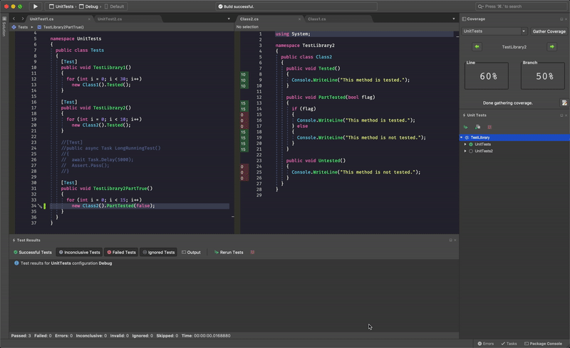

# VSMac-CodeCoverage

A code coverage extension for Visual Studio for Mac that provides a new pad for displaying coverage statistics and visualizing line coverage in the editor margin.

## Installation

1. Download the latest extension `.mpack` file from the [Releases](https://github.com/ademanuele/VSMac-CodeCoverage/releases) section.

2. In Visual Studio for Mac, open `Extension Manager -> Install from file...` and install the downloaded file.

3. Restart Visual Studio for Mac.

4. Done.

## Usage

You can access the Coverage pad through `View -> Pads -> Coverage`.

Select any test project that is currently open in the workspace using the dropdown menu and hit `Gather Coverage`.
Your test project should start running. When complete, line and branch coverage results for each covered project are shown on the pad as well as in margins for any editors that you have open.

## Planned Features

- Keyboard shortcuts
- Configurable editor margin colors
- Coverage graphs

## Reporting Issues

If you find a bug or have a feature request, please report them at this repository's issues section.

## Support

If you like this tool and would like to support its development, you can...

## Authors

* **Arthur Demanuele** - Author

* This extension also uses **Toni Solarin-Sodara**'s [coverlet](https://github.com/tonerdo/coverlet) coverage tool for gathering coverage.

## Acknowledgments

Big thanks to the [coverlet](https://github.com/tonerdo/coverlet) project, which made this extension possible.

Big thanks to [David Karlas](https://developercommunity.visualstudio.com/users/25964/06b25657-7e73-4eef-bfae-8a6c57e7e6c9.html) for resolving an [issue](https://developercommunity.visualstudio.com/content/problem/907691/unable-to-create-custom-vs-for-mac-editor-margin.html) with the editor margin functionality.

## License

This project is licensed under the MIT License - [full details](LICENSE.md).

See also [coverlet's licence](https://github.com/tonerdo/coverlet/blob/master/LICENSE).